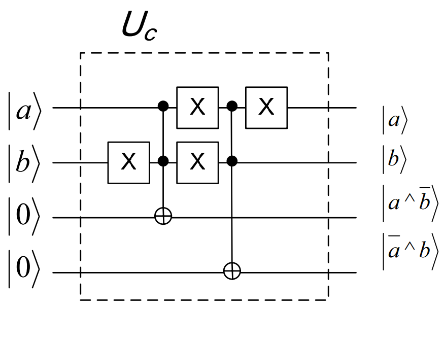
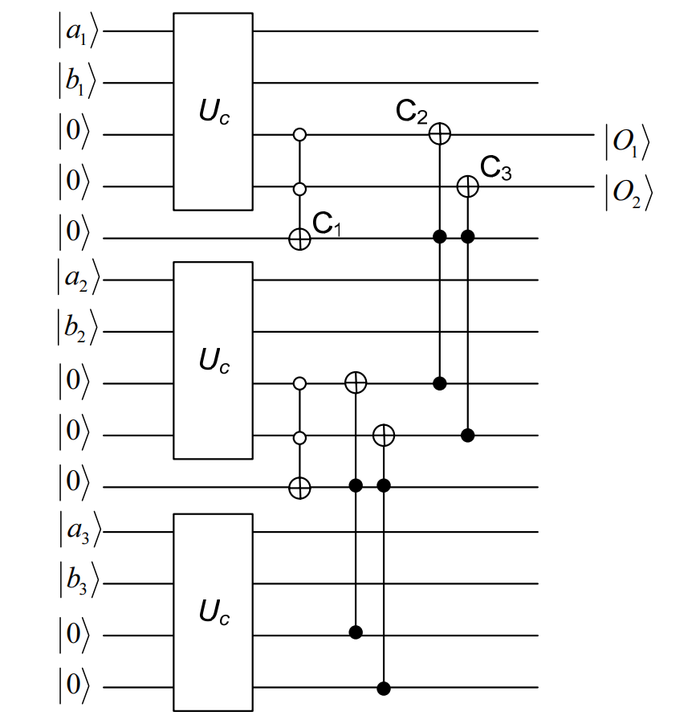

# Task 1: Find the largest number

## Problem Statement
You have two integers, either positive or negative, and the challenge is to generate a quantum algorithm that returns which is the larger number. Consider an appropriate number of qubits and explain why your proposal is valid for all kinds of numbers in case.

## Solution
To compare two number using a quantum circuit we can use Quantum Bit String Comparator (QBSC).

### Let's first understand the concept and maths behind the Quantum Bit String Comparator.

For understanding **Quantum Bit String Comporator**, first we have to understand  how **Quantum bit Comparator** works. 

#### Quantum Bit Comparator
Let `Uc` represent a circuit which takes 4 qubits(|a〉, |b〉, |x〉, |y〉) as n input (first two qubits are the qubits to be compared and other two qubits are ancillia qubits to store the result), compares first two qubit and flips the third qubit if first qubit is larger else it flips the fourth qubit.

This can easily be done by contructing the circuit for `Uc` as explained below:
- Apply `X` gate to |b〉 followed by applying `CCNOT` gate to |x〉 with |a〉 and |b〉 as control. This will flip |x〉 if |a〉 is greater than |b〉, i.e, when |a〉 = |1〉 and |b〉 = |0〉.
- Now bring back |b〉 to original state by applying `X` gate.
- Apply `X` gate to |a〉 followed by applying `CCNOT` gate to |y〉 with |a〉 and |b〉 as control. This will flip |y〉 if |b〉 is greater than |a〉, i.e, when |a〉 = |0〉 and |b〉 = |1〉.
- Now bring back |a〉 to original state by applying `X` gate.
 
 
The Circuit for Quantum Bit Comparator `Uc`:
 

 
The Truth table for above circuit can be given as:

| a | b | ā | ƀ | x = a ^ ƀ | y = ā ^ b |
|:-:|:-:|:-:|:-:|:---------:|:---------:|
| 0 | 0 | 1 | 1 | 0         | 0         |
| 0 | 1 | 1 | 0 | 0         | 1         |
| 1 | 0 | 0 | 1 | 1         | 0         |
| 1 | 1 | 0 | 0 | 0         | 0         |

*If a = b then x = y = 0, if a > b then x = 1 and y = 0, and if a < b then x = 0 and y = 1.*

#### Quantum Bit String Comparator
Let's consider two n-partite of qubits quantum state |a〉|b〉. Where |a〉 represents the first number, and |b〉 represents the second number we have to compare. Then the quantum bit string comparator, a unitary evolution `Ucmp` will work as:

**Ucmp|a〉|b〉|0⊗m〉|0〉|0〉 = |a〉|b〉|ψ〉|x〉|y〉**

Here, there are m+2 ancillas at the input, |ψ〉 is a m qubit output state that has not important information and the last two qubits carry the comparison information. This evolution by application of `Ucmp` can be done by using `Uc` for each qubit in |a〉 and |b〉 and then combining the result using one `Negative CCNOT` gate and two `CCNOT` gates. This circuit can compare two binary strings (having the same number of bits) identifying, by the measurement of two qubits, if they are equal or, if they are different, which of them is the largest (or the lowest).
 
 
The Circuit for Quantum Bit String Comparator `Ucmp` for comparison of two strings of three qubits: |a〉=|a1〉|a2〉|a3〉 and |b〉=|b1〉|b2〉|b3〉:
 

 
This quantum circuit compares the two numbers with the length of bitstring ( number of qubits) = 3, but the generalization to any number of qubits is straightforward.  The circuit is able to compare two binary strings (having the same number of bits) identifying, by the measurement of two qubits, if they are equal or, if they are different, which of them is the largest (or the lowest). The circuit compares the strings bit-to-bit from the left (most significant bit) to the right (less significant bit).  After the measurement of the outputs (O1 and O2), if O1=1 and O2=0 then a>b; if O1=0 and O2=1 then a<b; at last, if O1=0 and O2=0 then a=b.

### Algorithm of code

Since our quantum circuit only works for binary strings having the same number of bits we directly return output for the inputs with numbers having different sign or different length of bitsring.

**Case 1: When input numbers are of opposite sign.** 
  
If numbers have inputs with different sign then we return the positive number.

**Case 2: When inputs numbers have same sign but different length of bitstring.** 
 
> - If both input numbers are positive return the number with greater length of bitstring.
> - If both input numbers are negative return the number whose absolute value have greater length of bitstring.

**Case 3: When inputs numbers have same sign and same length of bitstring. Apply Quantum Bitstring Operator.**
 
*Step 1:* Determine the number of qubits needed to represent the inputs.    
This will be equal to the length of bitstring of anyone input number - 2. We subtract 2 from the length of bitstring as bitsrings starts with '0b' followed by binary equivalent of the number in python. So we exclude '0b' in all the steps.

*Step 2:* Create the quantum circuit.
> - Since for comparision of two n-bit numbers, we need to pass 4 qubits to each Uc and need (n-1) qubits to combine their results. So in total we need 4*n + (n - 1) qubits where n represents number of bits in bitstring.
> - We will require two clasical bits to store the result.

*Step 3:* Encode the inputs into the quantum states. 
   
As shown in the circuit for Quantum Bit String Comparator `Ucmp` we devide the number of qubits in a set of four, each set passing through `Uc` and seperated by a qubit from each other.
 
First two qubits of each set store the bits of two inputs at same position in their bitstring. next two qubits of each sets are to store output 'x' and 'y' of their set. The qubit seperating each set is for combining the comparision result of each bit.

*Step 4:* Apply Uc circuit for each bit at the same poisition in bitstrings of input numbers.
  
For each set of 4 qubits:
> - Apply X gate to the second qubit in the set (qubit storing bit of second number).
> - Apply CCNOT gate to the third qubit in the set with first and second qubit as control.
> - Bring back the second qubit to original state by applying X gate.
> - Apply X gate to the first qubit in the set (qubit storing bit of first number).
> - Apply CCNOT gate to the fourth qubit in the set with first and second qubit as control.
> - Bring back the first qubit to original state by applying X gate.

*Step 5:* Apply C1 for each set of four qubits passed into 'Uc'.
  
Apply Negative CCNOT gate(C1) to the qubit seperating each set of four qubits passed into `Uc` with third and fourth qubits (,i.e, qubits storing the result of bit comparision) of previous set as control.

*Step 6:* Apply C2 and C3 for each set of four qubits passed into 'Uc'.
  
Starting from the last set of of four qubits passed into 'Uc':
> - Apply CCNOT gate(C2) to the third qubit of the previous set with the thrid qubit of the current set and the qubit seperating the two sets as control.
> - Apply CCNOT gate(C3) to the fourth qubit of the previous set with the fourth qubit of the current set and the qubit seperating the two sets as control.

*Step 7:* Measure the result of the circuit stored in the third and the fourth qubits of the first set as |O1〉 and |O2〉.

*Step 8:* Simulate the circuit and get the result. The final result will be one of these bitstring in the format of 'O1 O2': '00', '01', or '10'.

*Step 9:* Return the largest number based on the result.
  
> - If input numbers are positive:   If O1=1 and O2=0 then return a; if O1=0 and O2=1 then return b; at last, if O1=0 and O2=0 then return anyone of the input as both are equal.
> - If input numbers are negative:   If O1=1 and O2=0 then return b; if O1=0 and O2=1 then return a; at last, if O1=0 and O2=0 then return anyone of the input as both are equal.

### References:
- [Deutsch, David, and Richard Jozsa. "Rapid solution of problems by quantum computation." Proceedings of the Royal Society of London. Series A: Mathematical and Physical Sciences 439.1907 (1992): 553-558](https://www.isical.ac.in/~rcbose/internship/lectures2016/rt08deutschjozsa.pdf)
- [Grover, Lov K. , "A fast quantum mechanical algorithm for database search", Proceedings of the 28th Annual ACM Symposium on the Theory of Computing (1996)](https://arxiv.org/abs/quant-ph/9605043)
- [Quantum bit string comparator: Circuits and applications by David Sena Oliveira and Rubens Ramos](https://www.researchgate.net/publication/228574906_Quantum_bit_string_comparator_Circuits_and_applications)

### Solution:
[Code for the solution of the task](./src/QOSF_Task1.ipynb)